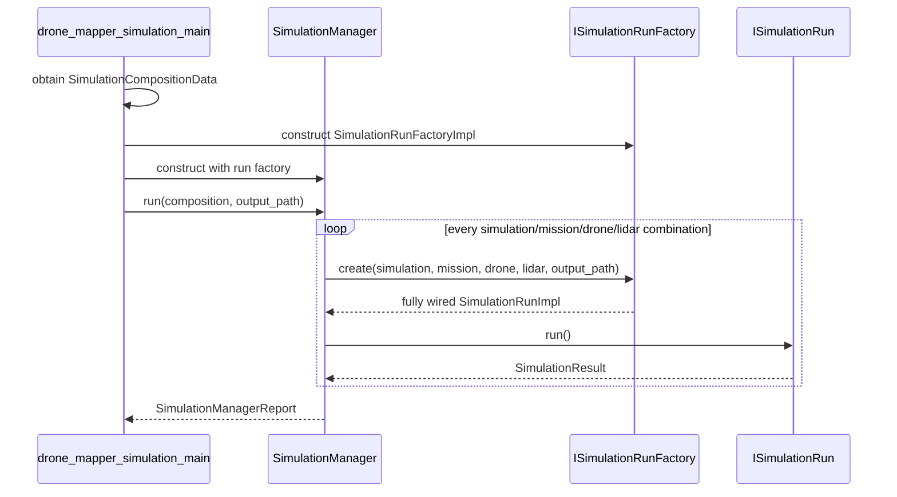
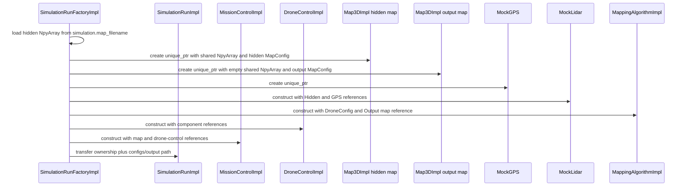
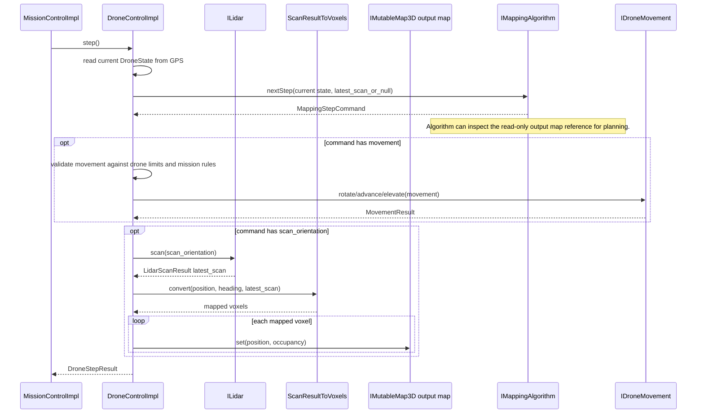
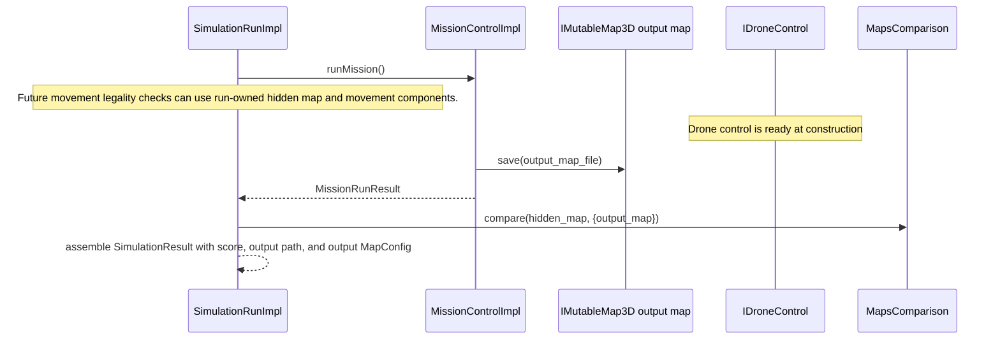

# Assignment 2 Skeleton HLD

This document describes the current high-level design of the Assignment 2 refactor skeleton. Most implementation classes are intentionally minimal stubs. `MockLidar` is the main exception: it preserves the provided mock sensor ray-marching behavior.

## Main Components

- `SimulationManager` is the top-level runner. It receives `types::SimulationCompositionData`, expands the cartesian product, and aggregates a `types::SimulationManagerReport`.
- `ISimulationRunFactory` is the single construction seam. It creates one fully wired run node for one simulation/mission/drone/LiDAR combination.
- `SimulationRunImpl` owns the full per-node runtime object graph, including maps, hardware-like components, drone control, and mission control. It also carries the simulation/mission config and output map path needed to return `types::SimulationResult`.
- `MissionControlImpl` receives references to the simulation-run-owned maps and drone control, saves the output map, and returns mission-level status/errors.
- `DroneControlImpl` receives required configs and references to simulation-run-owned dependencies, so it is ready at construction.
- `IMap3D` is read-only and exposes voxel lookup plus `types::MapConfig`, which groups boundaries, offset, and resolution. `IMutableMap3D` adds mutation and saving for output maps.
- Public signatures use explicit `types::...` names from focused headers. `SimulationTypes.h` holds simulator-only composition/report types.

## Map Geometry And Results

- `types::MapConfig` is the canonical map-geometry bundle: `MappingBounds`, `Position3D offset`, and `PhysicalLength resolution`.
- `types::SimulationConfigData` provides the hidden map file, hidden map resolution, map offset, initial drone position, and initial heading.
- `types::MissionConfigData` no longer owns mapping boundaries. Mission configuration is limited to mission behavior and requested output resolution parameters.
- `types::MissionRunResult` contains mission status, step count, and mission-level errors.
- `types::SimulationResult` contains one run's configs, mission results, output map file, output map config, resolution request status, and final score.
- `types::SimulationManagerReport` is the top-level aggregate over all generated `SimulationResult` runs.

## Class Diagram

```mermaid
classDiagram
    direction LR

    class ISimulation {
        <<interface>>
        +run(composition, output_path) report
    }

    class ISimulationRun {
        <<interface>>
        +run() result
    }

    class ISimulationRunFactory {
        <<interface>>
        +create(sim, mission, drone, lidar, output_path) run
    }

    class IMissionControl {
        <<interface>>
        +runMission() result
    }

    class IDroneControl {
        <<interface>>
        +step() step_result
        +state() state
    }

    class ILidar {
        <<interface>>
        +scan(orientation) scan
    }

    class IGPS {
        <<interface>>
        +position() position
        +heading() orientation
    }

    class IDroneMovement {
        <<interface>>
        +rotate(direction, angle) move_result
        +advance(distance) move_result
        +elevate(distance) move_result
    }

    class IMappingAlgorithm {
        <<interface>>
        +nextStep(state, latest_scan) step_command
    }

    class IMap3D {
        <<interface>>
        +atVoxel(pos) occupancy
        +getMapConfig() config
    }

    class IMutableMap3D {
        <<interface>>
        +set(pos, value) void
        +save(output_file) void
    }

    class SimulationManager {
        -unique_ptr~ISimulationRunFactory~ run_factory_
        +SimulationManager(run_factory)
        +run(composition, output_path) report
    }

    class SimulationRunFactoryImpl {
        +create(sim, mission, drone, lidar, output_path) run
    }

    class SimulationRunImpl {
        -unique_ptr~const IMap3D~ hidden_map_
        -unique_ptr~IMutableMap3D~ output_map_
        -unique_ptr~IGPS~ gps_
        -unique_ptr~IDroneMovement~ movement_
        -unique_ptr~ILidar~ lidar_
        -unique_ptr~IMappingAlgorithm~ mapping_algorithm_
        -unique_ptr~IDroneControl~ drone_control_
        -unique_ptr~IMissionControl~ mission_control_
        -SimulationConfigData simulation_config_
        -MissionConfigData mission_config_
        -path output_map_file_
        +SimulationRunImpl(runtime_objects, configs, output_file)
        +run() simulation_result
    }

    class MissionControlImpl {
        -MissionConfigData mission_
        -DroneConfigData drone_
        -IMap3D& hidden_map_
        -IMutableMap3D& output_map_
        -IDroneControl& drone_control_
        -path output_map_file_
        +MissionControlImpl(mission, drone, hidden_map&, output_map&, drone_control&, output_file)
        +runMission() result
    }

    class DroneControlImpl {
        -DroneConfigData drone_
        -MissionConfigData mission_
        -ILidar& lidar_
        -IGPS& gps_
        -IDroneMovement& movement_
        -IMutableMap3D& output_map_
        -IMappingAlgorithm& mapping_algorithm_
        +DroneControlImpl(drone, mission, lidar&, gps&, movement&, output_map&, mapping_algorithm&)
        +step() step_result
        +state() state
    }

    class MockLidar {
        -LidarConfigData config_
        -IMap3D& hidden_map_
        -IGPS& gps_
        +MockLidar(config, map&, gps&)
        +scan(orientation) scan
    }

    class Map3DImpl {
        -shared_ptr~NpyArray~ map_
        -MapConfig config_
        +Map3DImpl(shared_ptr~NpyArray~ map_ptr)
        +Map3DImpl(shared_ptr~NpyArray~ map_ptr, MapConfig config)
        +atVoxel(pos) occupancy
        +getMapConfig() config
        +set(pos, value) void
        +save(output_file) void
    }

    class MapsComparison {
        +compare(origin&, vector~IMap3D*~ targets) vector~double~
    }

    class MapConfig {
        +MappingBounds boundaries
        +Position3D offset
        +PhysicalLength resolution
    }

    class SimulationResult {
        +SimulationConfigData simulation_config
        +MissionConfigData mission_config
        +ResolutionRequestStatus resolution_request_status
        +vector~MissionRunResult~ mission_results
        +path output_map_file
        +MapConfig output_map_config
        +double mission_score
    }

    class SimulationManagerReport {
        +string generated_at_utc
        +string metric
        +tuple~double,double~ score_range
        +int error_score
        +vector~SimulationResult~ runs
    }

    ISimulation <|.. SimulationManager
    ISimulationRunFactory <|.. SimulationRunFactoryImpl
    ISimulationRun <|.. SimulationRunImpl
    IMissionControl <|.. MissionControlImpl
    IDroneControl <|.. DroneControlImpl
    ILidar <|.. MockLidar
    IMap3D <|-- IMutableMap3D
    IMutableMap3D <|.. Map3DImpl

    SimulationManager --> ISimulationRunFactory
    SimulationRunFactoryImpl --> SimulationRunImpl : transfers ownership
    SimulationRunImpl --> IMap3D : owns hidden map
    SimulationRunImpl --> IMutableMap3D : owns output map
    SimulationRunImpl --> IGPS
    SimulationRunImpl --> IDroneMovement
    SimulationRunImpl --> ILidar
    SimulationRunImpl --> IMappingAlgorithm
    SimulationRunImpl --> IDroneControl
    SimulationRunImpl --> IMissionControl
    MissionControlImpl --> IMap3D : hidden map reference
    MissionControlImpl --> IMutableMap3D : output map reference
    MissionControlImpl --> IDroneControl : reference
    DroneControlImpl --> ILidar : reference
    DroneControlImpl --> IGPS : reference
    DroneControlImpl --> IDroneMovement : reference
    DroneControlImpl --> IMutableMap3D : reference
    DroneControlImpl --> IMappingAlgorithm : reference
    MockLidar --> IMap3D : hidden map reference
    MapsComparison --> IMap3D
    IMap3D --> MapConfig
    SimulationRunImpl --> SimulationResult
    SimulationManager --> SimulationManagerReport
    SimulationManagerReport --> SimulationResult
    SimulationResult --> MapConfig
```

## Top-Level Run Flow

## Factory Wiring Flow

##  Mission Run Flow

The first step calls `nextStep(state, nullptr)` because no LiDAR result exists yet. Each step command may request movement, a scan, both, or neither. If both are requested, movement is validated and executed first, then the scan is performed from the updated state and written into the output map.

##  Single Simulation Run Flow

## Current Stub Boundaries

The attached stub implementations are examples only. You should provide their own implementations for:

- YAML parsing and composition loading.
- Mission execution and drone step loops.
- Movement legality checks.
- Output-map mutation and real `.npy` serialization.
- Scan-to-voxel conversion.
- Mapping algorithm behavior.
- Map comparison scoring.
- Simulation output writing and error-log writing.
